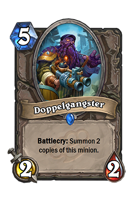
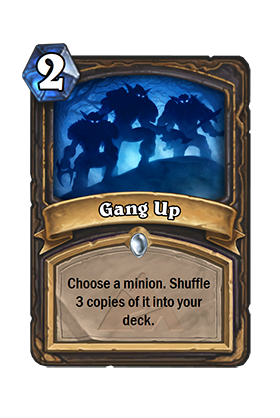
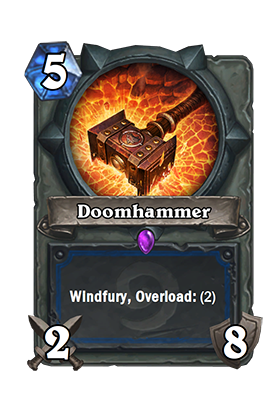

Hearthstone card creation resources. Intended to be used as the basis of a Hearthstone card renderer, such as [Neferset](https://github.com/andburn/neferset).

Contains card image assets with layout coordinates in json. A number of card styles are provided and can be found in
the [styles](styles/) directory.

## Default
The standard Hearthstone card style.

## Pure
Inspired by [@rgbjoy](https://twitter.com/rgbjoy)'s concept from [2013](https://twitter.com/rgbjoy/status/413542341660917760).

